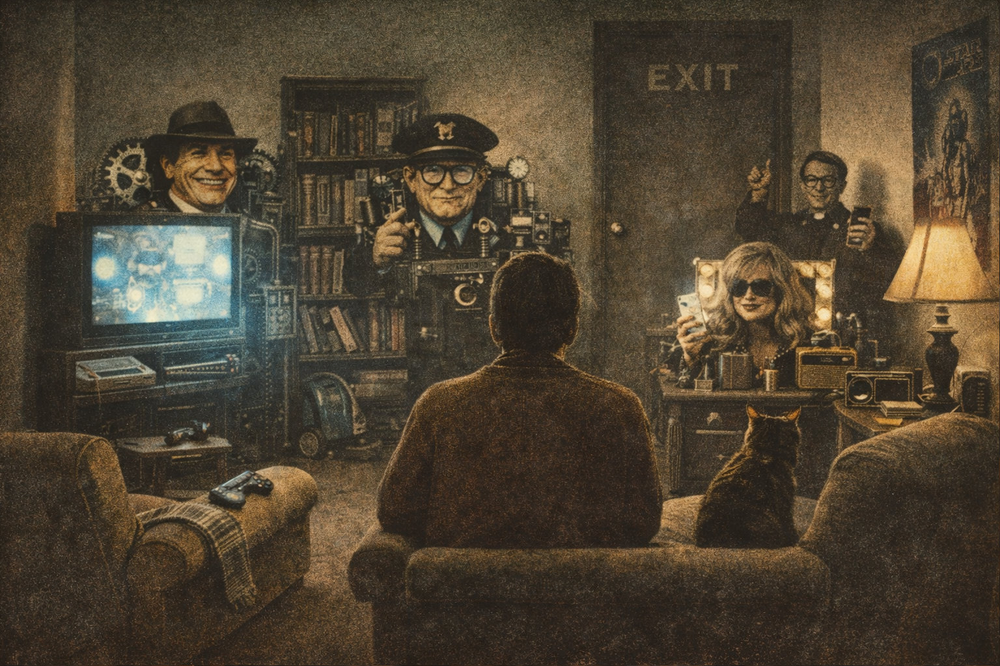

+++
title = "Exit as Epistemology"
date = 2026-01-18T00:00:00-05:00
description = "The fog lifts and you see that ground was always uneven."
summary = "We built systems sophisticated enough to show us how the trick works. The trick is load-bearing, but not all tricks are equal. Some fictions enable coordination; others extract from you. The difference matters."
tags = ['attention', 'trust', 'epistemology', 'internet', 'culture', 'autonomy']
categories = ["Essays"]
showToc = true
draft = true
slug = 'exit-as-epistemology'
cover = { image = '', alt = '', caption = '' }
+++

---

There is a fog that settles over modern life. Not a single dramatic crisis, but a persistent inability to trust your own read of things. You finish scrolling and can't say what you learned. You hear confident voices on all sides and none of them seem to describe the world you actually live in. You suspect the institutions are broken but can't tell which ones, or how badly, or whether the people shouting about it are any better. The experience isn't shock. It's numbness. Dissociation. A quiet, chronic confusion that makes it hard to act with conviction.

The uncomfortable thesis: *humans have always needed simplifying stories to coordinate and act. What's new is that you can watch yours being manufactured in real time.*

We built attention economies, algorithmic feeds, engagement optimization. Systems sophisticated enough to make the machinery of reality-construction visible. This revealed something: we've always run on constructed consensus. But it also created something new: extraction pipelines optimized against your attention with a precision that older fictions never had.

These are not the same phenomenon. A shared myth that lets strangers cooperate is not the same as a feed tuned to maximize your time-on-site. The first is load-bearing. The second is parasitic. The essay that follows is about telling them apart.

---

## Coordination fictions vs. extraction machines

When the world stops making sense, you reach for something that restores predictability. Retreat into a smaller circle. Sort into a tribe that shares your priors. Harden your moral categories so at least you know who's bad. These moves reduce anxiety. They restore a feeling of orientation. But they swap one fog for another: the fog of confusion for the fog of motivated reasoning.

The standard critique says: *this is the problem. You're being manipulated. Wake up.*

But that critique is too simple. Humans have always lived inside constructed consensus. Religions that explained suffering and promised meaning. National myths that turned arbitrary borders into sacred homelands. Economic ideologies that made particular arrangements of power seem natural. Social scripts that defined success, virtue, belonging. These weren't failures of epistemology. They were coordination mechanisms. They let people sacrifice for strangers, raise children with shared expectations, face death with some composure.

Call these *coordination fictions*. They're the stories groups tell to solve problems that can't be solved by individuals acting alone: trust, sacrifice, long time horizons, collective action.

But not all fictions serve coordination. Some serve extraction. An algorithmic feed optimized on engagement doesn't help you coordinate with anyone. It captures your attention and sells it. A news cycle tuned for outrage doesn't help you understand events. It keeps you cycling. A credential system gamed past the point of signal doesn't help employers find competence. It extracts tuition and time.

Call these *extraction machines*. They wear the costume of coordination (community, information, opportunity) while operating on a different logic (maximize time captured, revenue extracted, dependency created).

The insight "humans need stories" does not mean all stories are equivalent. The question is whether a given fiction solves a coordination problem or creates a capture loop. This distinction is not always clean. Many systems do both. But flattening them into "it's all fog" dissolves the only criterion that matters for action.

---

## Why the machinery is visible now

A proxy is a stand-in. Something easier to measure that's supposed to track something harder to see. Credentials proxy for competence. Engagement proxies for value. Rankings proxy for quality. Proxies have always drifted. The medieval church sold indulgences. Universities have always traded partly in status signaling.

What's modern is the speed and visibility of the drift.

Goodhart's Law says that when a measure becomes a target, it ceases to be a good measure. This used to operate slowly. It took generations for institutions to hollow out while maintaining their symbols. Now it happens in real-time. You can watch engagement metrics diverge from value. You can see credentials inflate. You can observe the SEO arms race, the review manipulation, the bot networks, the algorithmic slot machines.

The optimization pressure is so intense, so continuous, so visible that the gap between proxy and reality has become undeniable. Not because the gap is larger than before, but because you can see it happening.

**Proxy fights replace fact fights.** Controlling the proxy pipeline (feeds, rankings, moderation, credentials, institutional prestige) shapes which questions can be asked at all. You don't need to censor a claim if you can make it unfindable. You don't need to refute an argument if you can make the person who raises it seem low-status. The action has moved upstream, to the infrastructure of salience.

It was always upstream. The church controlled which questions were askable. The state controlled which histories were taught. The guild controlled which knowledge was legitimate. What's new is that you can see the management happening.

And increasingly, what's new is that *law* is making the management visible. The EU's Digital Services Act forces platforms to disclose how content is ranked and why accounts are suspended. The AI Act requires labeling synthetic media. Enforcement actions against platforms for deceptive design turn "fog" from metaphor into liability. Visibility is no longer just a side effect of optimization intensity. It's becoming a regulatory product.

---

## What you can actually know

*Invariants* are constraints that survive persuasion. Not facts you've been told, but binding conditions that don't change when someone argues with you.

Economic invariants: switching costs, lock-in, network effects. You can debate whether a platform is good, but the cost of moving your data and rebuilding your audience is a brute fact.

Psychological invariants: the decay rate of memory, the stickiness of identity, the finite bandwidth of attention, the pain of being visibly wrong.

Social invariants: the time required to build trust, the cost of defection from a group, the way status hierarchies constrain what can be said by whom.

What these have in common is that they're what you crash into when your model is wrong. They're ground. Not perfectly solid ground, not ground that can't be shaped, but ground that resists your projections.

Some invariants are natural. Attention is finite. Memory decays. Trust takes time. These are terrain.

Some invariants are designed. Switching costs can be engineered through proprietary formats, non-portable social graphs, credentials that don't transfer. These are fortifications someone built on the terrain.

The distinction matters. Natural constraints are facts to work with. Designed constraints are choices someone made, and choices can be contested. When exit costs are engineered, raising them is a strategy, not a law of nature. Recognizing designed invariants is the first step to demanding they be lowered.

---

## Exit and voice

"Exit" means the ability to stop participating in a loop without catastrophic penalty. You can exit a platform, a relationship, a career, a belief, a community.

You cannot exit the need for coordination, meaning, identity. You will always be inside some story. The question is whether the story you're in solves coordination problems or extracts from you while pretending to.

The attention economy competes upstream for *question selection*, not just for time. The system doesn't need you to believe any particular thing. It needs you to keep cycling. The engagement loop, the outrage loop, the hope loop, the fear loop. All of them benefit from your continued motion. Stillness is the threat. Clarity is the threat.

The system can sell you the fantasy of escape. Minimalism. Digital detox. "Authentic living." These are products too. The exit becomes another entrance.

But exit is not the only response. *Voice* is the other.

Voice means staying inside a system and working to change it: complaining, organizing, advocating, building alternatives, demanding disclosure, supporting enforcement. Voice is costly. It requires that the system be at least partially responsive to pressure. But when exit costs are high and the system shapes your options, voice may be the only lever.

This is why the regulatory turn matters. Data portability lowers exit costs by letting you take your history with you. Interoperability requirements prevent lock-in from compounding. Transparency mandates make voice more effective by giving you something concrete to demand. Liability regimes make the cost of manufactured fog fall on its producers instead of its targets.

These are not individual lifestyle choices. They're collective mechanisms that change the structure of the game. You participate in them by supporting enforcement, using tools that implement portability, choosing services that compete on interoperability, and treating disclosure requirements as a floor to be raised rather than a ceiling.

---

## Asking good questions

There's a difference between being lost and knowing you're lost.

When you feel fog, when comfort rises fast, when outrage spikes, when you can't tell what kind of game you're playing: these questions help you see the shape of the board.

1. **Name the loop.** What repeated behavior is being induced? What is the system trying to get me to do again?

2. **Name the exit cost.** What would I lose by stopping? Is this cost natural (attention is finite, trust takes time) or designed (proprietary formats, non-portable graphs)?

3. **Name the beneficiary.** Who benefits from the loop continuing? Does the loop solve a coordination problem I actually have, or does it extract from me while wearing the costume of community, information, or opportunity?

4. **Demand a falsifier.** What would prove my current model wrong? If I cannot name one, I am not holding a belief. I am holding an identity.

5. **Choose a response.** Exit, voice, or loyalty. If exit is too costly, is there a voice channel? If voice is ineffective, what would make it effective?

The refrain: *What would it cost to leave, and who set that price?*

---

## The trap of lucid spectatorship

A warning. "Seeing the wires" feels like waking up. It confers a sense of superiority over the credulous. It's culturally fashionable. It's also easily monetized.

This makes lucidity itself a capture risk.

You can build an identity around being the one who sees through things. You can consume content that confirms your sophistication. You can perform skepticism as a status marker while remaining just as predictable, just as captured, just as looped as anyone else. The feed that shows you how the feed works is still a feed.

If your model of the situation doesn't include falsifiers, if you can't name what would change your behavior, if "seeing clearly" has become a stable self-image rather than an ongoing discipline, then you've converted insight into decoration.

The test is not whether you can describe the trap. The test is whether you have a record of changing your behavior based on what you learned, and whether that record is visible to yourself over time.

---

## An example

Doomscrolling through a contentious news cycle. Two hours in. You feel informed, agitated, righteous, unable to stop. You have opinions now. Strong ones. You're not sure what you'll do with them.

**The loop:** Scroll, react, refresh. Every strong emotion is a signal to keep cycling.

**The exit cost:** The feeling of being informed. The social currency of having a position. The anxiety of missing something important. These are partly natural (you do need some information, belonging does matter) and partly designed (the platform makes missing out feel urgent).

**The beneficiary:** The platform, the content producers rewarded for provoking reaction, the algorithms tuned to maximize session time. The loop doesn't solve a coordination problem you have. It extracts attention while wearing the costume of civic participation.

**The falsifier:** What would prove this engagement is valuable? If you cannot name a decision this information will improve, you are not informing yourself. You are being audience.

**The response:** Exit (stop, set a timer, follow the story through a slower medium). Voice (support policies that require algorithmic transparency, use tools that let you control your feed). Or, honestly, loyalty (keep scrolling, but know what you're paying).

Even after running these questions, you might keep scrolling. The loop might be providing something real: connection, stimulation, the feeling of participation. The point isn't to optimize your behavior. The point is to know what you're trading for what.

---

## What makes a story worth choosing

You cannot live without a story. The brain that evolution gave you is not designed for naked contact with reality. It's designed to construct a workable model that lets you act, plan, hope, endure.

But "choose your own story" is too thin as guidance. It collapses into "pick whatever feels good," which is exactly the logic extraction machines use: your preferences as a manipulable input, not a reasoned commitment.

A story worth choosing has three properties:

**It has falsifiers.** You can name conditions under which you would abandon or revise it. If nothing could change your mind, you're not holding a belief. You're holding an identity, and identities are what extraction machines feed on.

**It has costed commitments.** It asks something of you that you wouldn't do if you didn't hold it. A story that only confirms what you'd do anyway isn't shaping your behavior. It's decorating it.

**It has a record.** You can look back and see whether your predictions came true, whether your commitments were kept, whether you updated when evidence arrived. Without a record, you can't distinguish between "I learn from experience" and "I rewrite my memory to flatter my self-image."

Falsifiers, commitments, records. These are the difference between a chosen story and a captured one. They're also the difference between authorship and performance.

The fog is not the enemy. *Unaccountable* fog is the enemy: stories you hold without knowing you hold them, commitments you think you've made but never test, a self-image maintained by forgetting what you said last year.

---

## What would change things

Individual practices don't change systems. But individuals acting through collective mechanisms can.

Data portability lowers exit costs. Interoperability prevents lock-in. Transparency mandates make extraction visible. Liability regimes shift costs from targets to producers. Antitrust enforcement prevents the consolidation of proxy pipelines.

These mechanisms won't end the fog. Coordination fictions are permanent. But they can shift the balance between fictions that solve problems and machines that extract from you. They can lower the cost of exit and raise the effectiveness of voice.

You participate in these mechanisms by using portable tools, supporting enforcement, demanding disclosure, and treating current protections as a floor to be raised. This is not private coping. It's engineering local legibility.

---

## Closing

Humans need simplifying stories to coordinate and act. This is not a bug to be fixed. It's the ground we stand on.

But not all stories are equal. Some solve coordination problems: trust, sacrifice, long time horizons, collective action. Some extract from you while wearing the costume of community, information, opportunity.

The questions:

*What is the loop?*  
*What is the exit cost, and who set it?*  
*Does this solve a coordination problem I have, or does it extract from me?*  
*What would prove me wrong?*  
*Is my response exit, voice, or loyalty?*

These questions don't dissolve the fog. They tell you which fog you're in and what it costs. They give you ground that resists your projections. They let you hold stories accountable.

You won't escape the need for stories. But you can stop confusing extraction machines for coordination mechanisms. You can keep a record. You can demand that designed constraints be disclosed and contested.

That's not windmill-fighting. That's engineering better contracts with your own mind and with other people.

---

## Related Essays

- *[When the Funnel Eats the Work]()*: The production side of these dynamics. How selection pressures reshape creative work, and how to distinguish conversion (the work changes you) from capture (the system manages your attention).

- *[The Elements of a Good and Widely Appealing Game]()*: A structural analysis of why certain works recruit lasting love while others capture time without converting it. The "conversion vs. capture" distinction developed there is a special case of the exit-pricing lens here.

---

## Appendix: Sources

### On attention and extraction

**Herbert Simon**, "Designing Organizations for an Information-Rich World" (1971). "A wealth of information creates a poverty of attention."

**Natasha Dow Schüll**, *Addiction by Design* (2012). Ethnography of slot machine design. Capture mechanics were perfected in casinos before migrating to screens.

**Tim Wu**, *The Attention Merchants* (2016). How attention became commodity. The pattern: new media promises liberation, then gets captured by advertising logic.

### On proxies and their drift

**Charles Goodhart** (1975) and **Marilyn Strathern** (1997). "When a measure becomes a target, it ceases to be a good measure."

**Jerry Muller**, *The Tyranny of Metrics* (2018). How metric fixation degrades institutions. Goodhart's Law has body counts.

### On coordination fictions

**Peter Berger and Thomas Luckmann**, *The Social Construction of Reality* (1966). How societies manufacture and maintain consensus reality.

**Benedict Anderson**, *Imagined Communities* (1983). Nations as constructed fictions that enable coordination among strangers.

**Elinor Ostrom**, *Governing the Commons* (1990). How communities build shared fictions (rules, norms, institutions) to solve coordination problems without central authority.

### On exit, voice, and structural position

**Albert O. Hirschman**, *Exit, Voice, and Loyalty* (1970). How people respond to decline: leave, complain, or stay loyal.

**James C. Scott**, *Seeing Like a State* (1998). How power simplifies complex realities to make them governable. Legibility as a condition that can be produced or denied.

### On platforms, lock-in, and regulatory response

**Cory Doctorow**, "Enshittification" (2023). Platform lifecycle: attract users, degrade service, extract value, collapse.

**Shoshana Zuboff**, *The Age of Surveillance Capitalism* (2019). The product is not your attention but your future behavior.

**European Commission**, Digital Services Act enforcement documentation (2024-2026). How transparency and liability are being operationalized as regulatory tools.

---

*Drafting assistance: Claude Opus.*
